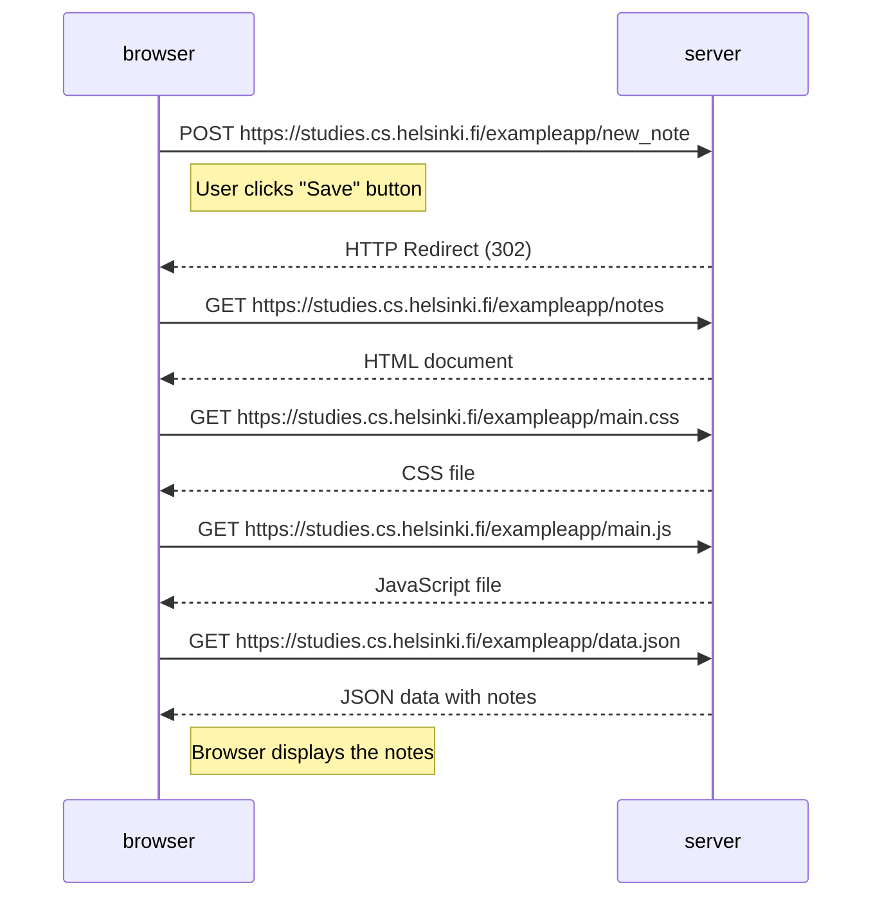

# 0.4: New Note Diagram

When the user adds a new note:
1. Browser sends the note to the server
2. Server tells browser to reload the page
3. Browser reloads the page and gets all files again
4. Browser shows the updated list with the new note 