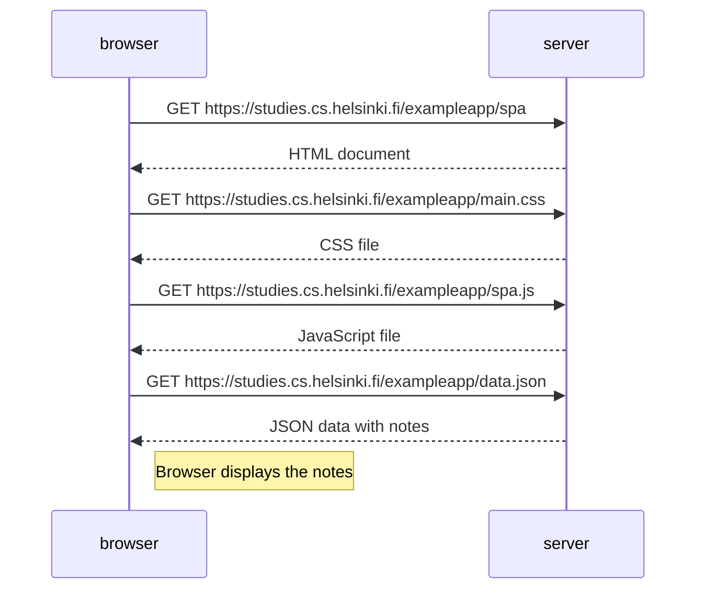

# 0.5: Single Page App Diagram

When the user visits the SPA version:
1. Browser asks for the SPA HTML page
2. Browser gets the CSS file to make the page look good
3. Browser gets the JavaScript file for the SPA
4. Browser uses JavaScript to ask for the notes data
5. Browser shows the notes on the screen

The key difference from the traditional version is that the SPA uses JavaScript to dynamically render the content without full page reloads, and it uses different JavaScript (spa.js) which handles the page differently. 