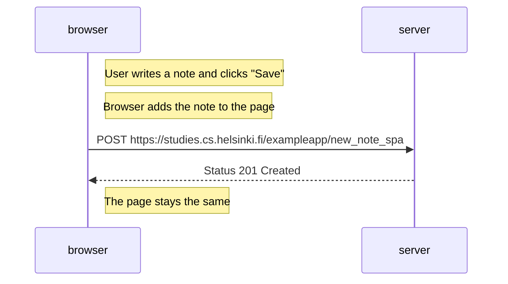

# 0.6: New Note in Single Page App Diagram

When the user adds a new note in the SPA:
1. User writes a note and clicks save
2. Browser immediately adds the note to the page
3. Browser sends the note to the server
4. Server confirms it got the note
5. No page reload happens! 